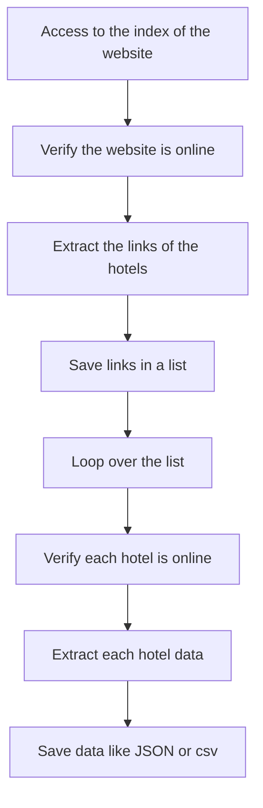

# Scraper-Riviera-Maya-Hotels

La Gaceta is a touristic zone in Mexico. The scraping was done in the site of hotel's organization.

Link to La Hotel's organization of Riviera Maya: http://rivieramaya.org.mx/

All the scraping process followed the rules of the robots.txt file.

----

**Table of Contents**

* **hotels_riviera** is the folder with all files used for the scraping process.
* **riviera_data.ipynb** is the notebook which extracts the links to each hotel.
* **hotels_total_data.ipynb** is the notebook which extracts the information per hotel.

----

### Outcomes 

- Name of hotel.
- Hotel address.
- Hotel mail.
- Hotel phone.
- Hotel fax.
- Hotel website.

 
----

                
### FlowChart of the Scrapping
---

### Contacts:
---
- [Twitter](https://twitter.com/sarasti_seb)
- [LinkedIn](https://linkedin.com/in/sebastiansarasti)
- [ResearchGate](https://www.researchgate.net/profile/Sebastian-Sarasti-2)
